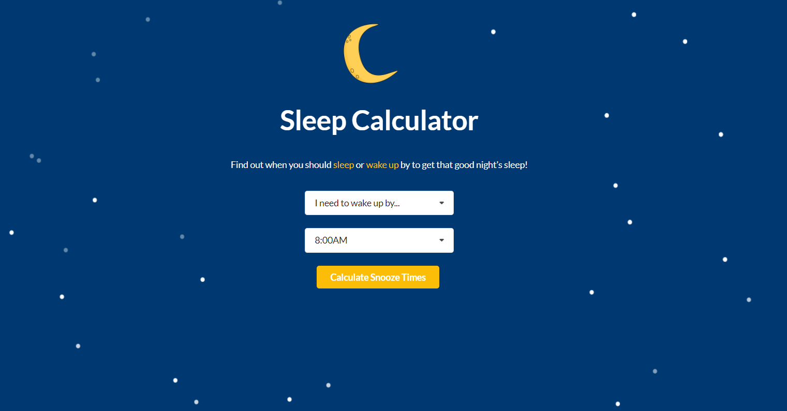

# Sleep Calculator

An application created to calculate the ideal times to sleep or wake up to ensure you feel rested in the morning.

This project was bootstrapped with [Create React App](https://github.com/facebook/create-react-app) and based off of [Ecosa's Sleep Calculator](https://www.ecosa.com.au/sleep-calculator).

## [Click here to try it out!](https://williambhuynh.github.io/sleep_calculator/)

